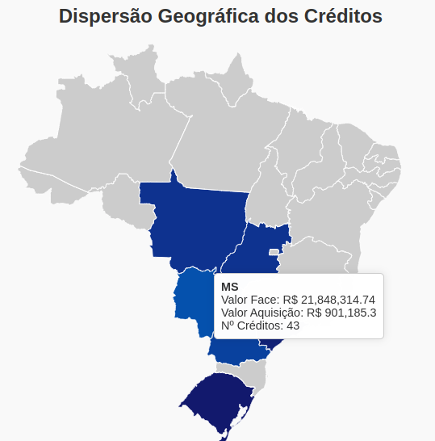

# 📄 CNAB - Análise e Visualização de Créditos Cedidos

## 📌 O que é um arquivo CNAB?

CNAB (Centro Nacional de Automação Bancária) é um padrão de arquivo utilizado no Brasil para a troca de informações financeiras entre empresas e instituições bancárias. Ele é amplamente utilizado para envio de **remessas de cobrança, pagamento e liquidação de títulos**, entre outros serviços bancários automatizados.

Cada arquivo CNAB possui **layout fixo**, com campos posicionais que representam dados como CPF/CNPJ, valor de título, data de vencimento, UF, entre outros. No contexto do mercado financeiro, esses arquivos são especialmente úteis para operações como **cessão de crédito**, onde uma empresa vende seus recebíveis (valores a receber) para um fundo.

---

## 🧠 Objetivo do Projeto

Este projeto realiza a **extração, análise e visualização** de dados contidos em um arquivo CNAB fictício, gerando um relatório interativo com métricas importantes sobre uma cessão de créditos enviada ao fundo. O relatório é gerado em formato HTML e apresenta gráficos, tabelas e um **mapa interativo do Brasil** com a dispersão geográfica dos créditos.

---

## 📁 Estrutura do Projeto

```
.
├── analiza_informacoes.py              # Analisa e processa estatísticas do CSV
├── extrai_informacoes.py              # Extrai informações do CNAB para CSV
├── infos_extraidas.csv                # CSV gerado com os dados estruturados
├── mapa_interativo/
│   ├── assets/                        # Arquivos auxiliares para o mapa
│   ├── dados_grafico.csv             # Dados para gráfico de linha
│   ├── dados_mapa_clean.csv          # Dados geográficos por UF
│   ├── index.html                    # Página interativa final
│   └── style.css                     # Estilos visuais do HTML
├── notebook_analiza_informacoes.ipynb# Notebook de apoio à análise
├── README.md                         # Este arquivo
└── REMFIDC11042025143341.txt         # Arquivo CNAB original
```

---

## ⚙️ Etapas da Solução

### 1. **Extração de Dados do CNAB**
O script `extrai_informacoes.py` processa o arquivo CNAB `REMFIDC11042025143341.txt` e gera o arquivo `infos_extraidas.csv` com os seguintes campos:

- `cnpj_cpf`: Identificador do sacado
- `tipo_pessoa`: PF ou PJ
- `nome`: Nome do sacado
- `valor_titulo`: Valor de face do crédito
- `taxa_cessao`: Taxa de cessão aplicada
- `vencimento`: Data de vencimento do título
- `dias_ate_venc`: Dias corridos até o vencimento
- `valor_aquisicao`: Valor presente com base na taxa e prazo
- `uf`: Unidade federativa do sacado

---

### 2. **Análise Estatística**
O script `analiza_informacoes.py` consome o `infos_extraidas.csv` e calcula:

- ✅ **Valor total de aquisição da cessão**
- ✅ **Top 5 sacados com maior valor de face agregado**
- ✅ **Número de créditos PF e PJ**
- ✅ **Ticket médio por tipo de pessoa**
- ✅ **Prazo médio de vencimento (total, PF, PJ)**
- ✅ **Gráfico: Valor de aquisição por data de vencimento**
- ✅ **Mapa: Dispersão geográfica por UF**

Gera dois arquivos auxiliares para visualização:
- `dados_grafico.csv`
- `dados_mapa_clean.csv`

---

### 3. **Relatório Interativo (HTML + JS + CSS)**
A pasta `mapa_interativo/` contém a página `index.html`, que apresenta os resultados em uma interface amigável com:

- Gráfico de linha (valor de aquisição × data de vencimento)
- Mapa do Brasil com dispersão por UF
- Informações agregadas e tabelas

---

## 📊 Visualizando o Relatório

### ✅ Rodar com servidor local

```bash
cd mapa_interativo
python3 -m http.server 8000
```

Acesse no navegador:
```
http://localhost:8000
```
---

## Preview

### Página inteira


### Mapa interativo


---


## ✅ Requisitos

- Python 3.8 ou superior
- Bibliotecas:
  ```bash
  pip install pandas matplotlib
  ```

---

## 🚀 Como Executar o Projeto

1. **Extraia os dados do CNAB**:
   ```bash
   python extrai_informacoes.py
   ```

2. **Gere os dados e estatísticas para visualização**:
   ```bash
   python analiza_informacoes.py
   ```

3. **Inicie o servidor e acesse o mapa**:
   ```bash
   cd mapa_interativo
   python3 -m http.server 8000
   ```


